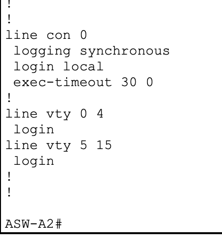

# CCNA Mega Lab Portfolio

Hands-on networking portfolio documenting my progress through **Jeremy's IT Lab CCNA Mega Lab** in **Cisco Packet Tracer**.

This repository is a learning portfolio. It documents the configurations I performed, how I verified them, the troubleshooting steps I used, and the networking concepts reinforced during the lab.

## Current Progress

**Completed**
- Part 1 — Initial Setup
- Part 2 — VLANs & Layer 2 EtherChannel

**Next**
- Part 3 — IP Addresses, Layer 3 EtherChannel & HSRP

## Topology


## Skills Demonstrated So Far

- Cisco IOS CLI configuration and verification
- Layer 2 switching
- VLAN creation and assignment
- 802.1Q trunking
- Native and allowed VLAN configuration
- DTP disablement with `switchport nonegotiate`
- PAgP EtherChannel
- LACP EtherChannel concepts and troubleshooting
- VTP version 2 server/client configuration
- Access-port configuration
- Voice VLAN configuration
- WLC/LWAP switchport connectivity
- Interface-status verification
- Administrative shutdown of unused switchports
- Saving device configurations to startup-config
- Troubleshooting configuration mistakes with Cisco `show` commands

## Evidence Gallery

### Part 1 — Console Security & Session Settings


### PAgP EtherChannel — Office A


### LACP EtherChannel — Office B


### Office B Trunk Verification


### VTP Client Verification


### VLAN Database Verification


### LWAP Access Port — Management VLAN


### Data + Voice VLAN Port


### WLC Trunk — VLANs 40 and 99


### Unused Port Shutdown Verification


## Part 2 Network Segmentation

### Office A

| VLAN | Name | Purpose |
|---|---|---|
| 10 | PCs | User data |
| 20 | Phones | Voice |
| 40 | Wi-Fi | Wireless |
| 99 | Management | Network management |
| 1000 | Native | Unused native VLAN on infrastructure trunks |

Office A uses **PAgP** for the Layer 2 EtherChannel between its distribution switches. Infrastructure trunks carry VLANs **10, 20, 40, and 99**.

### Office B

| VLAN | Name | Purpose |
|---|---|---|
| 10 | PCs | User data |
| 20 | Phones | Voice |
| 30 | Servers | Server network |
| 99 | Management | Network management |
| 1000 | Native | Unused native VLAN on infrastructure trunks |

Office B uses **LACP** for the Layer 2 EtherChannel between its distribution switches. Infrastructure trunks carry VLANs **10, 20, 30, and 99**.

## Verification Approach

I verify the operational state after configuration instead of assuming a command worked because IOS accepted it.

```text
show interfaces status
show interfaces trunk
show interfaces <interface> switchport
show etherchannel summary
show vtp status
show vlan brief
```

Configurations are saved with:

```text
copy running-config startup-config
```

## Documentation

- [Part 1 — Initial Setup](docs/part-01-initial-setup.md)
- [Part 2 — VLANs & Layer 2 EtherChannel](docs/part-02-vlans-etherchannel.md)
- [Troubleshooting & Validation Notes](docs/troubleshooting.md)
- [Configuration Archive](configs/README.md)
- [Screenshot Evidence](screenshots/README.md)

## Portfolio Goal

The purpose of this repository is to demonstrate practical networking fundamentals through reproducible lab work: configure, verify, troubleshoot, document, and explain.

> This is a training/lab environment and is not presented as production network experience.
