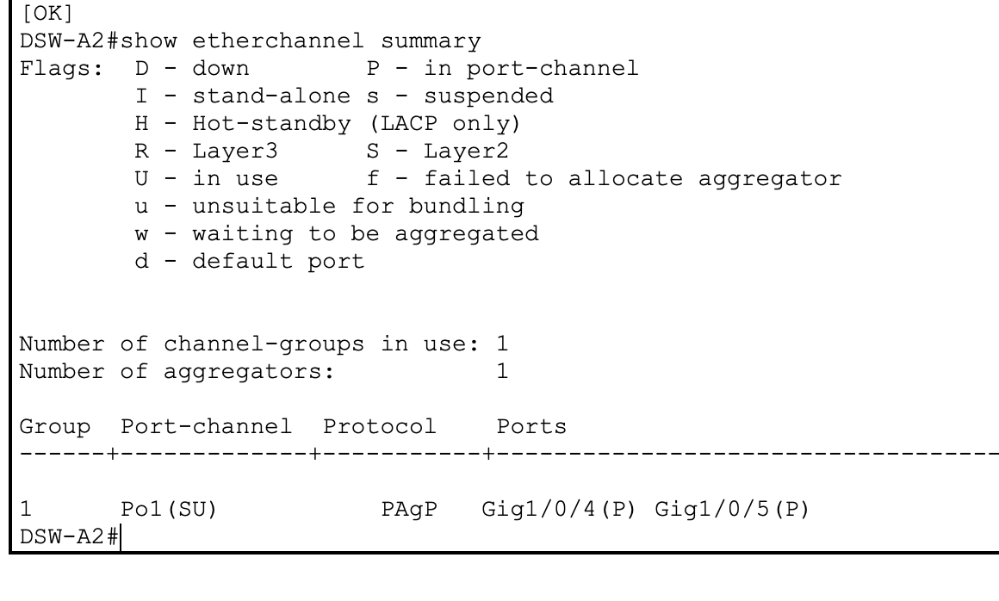
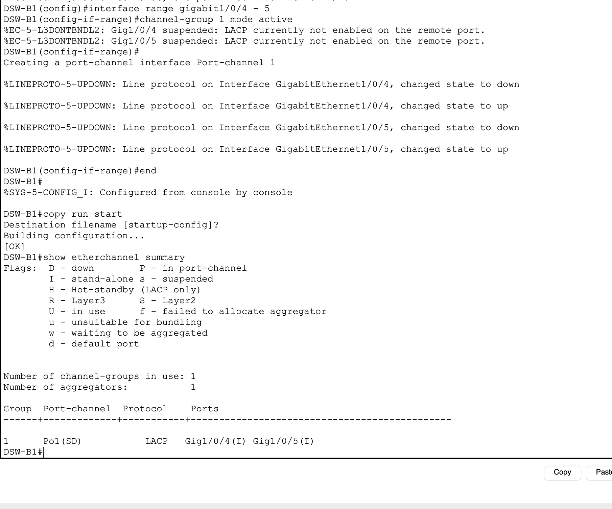
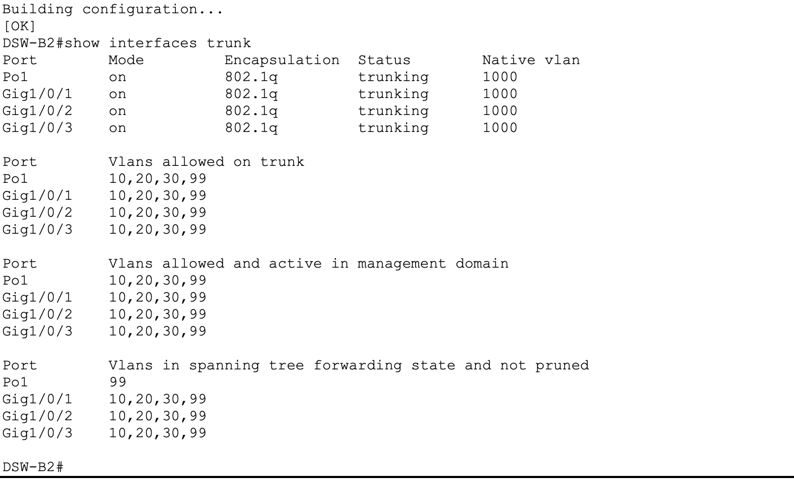
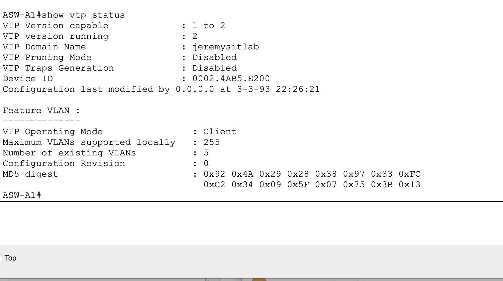
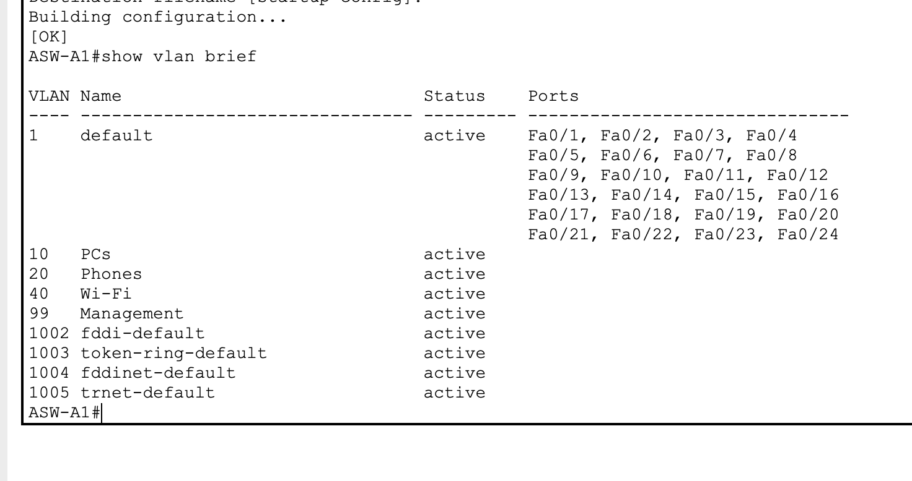
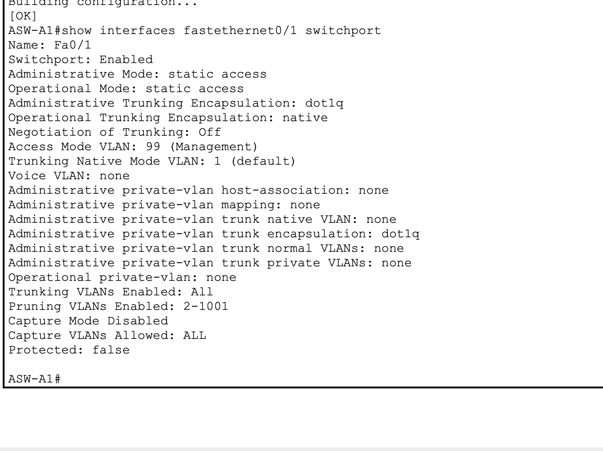
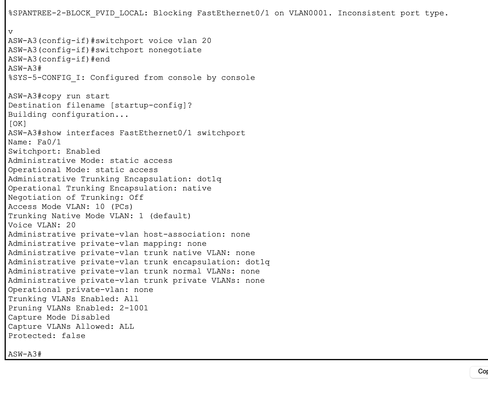
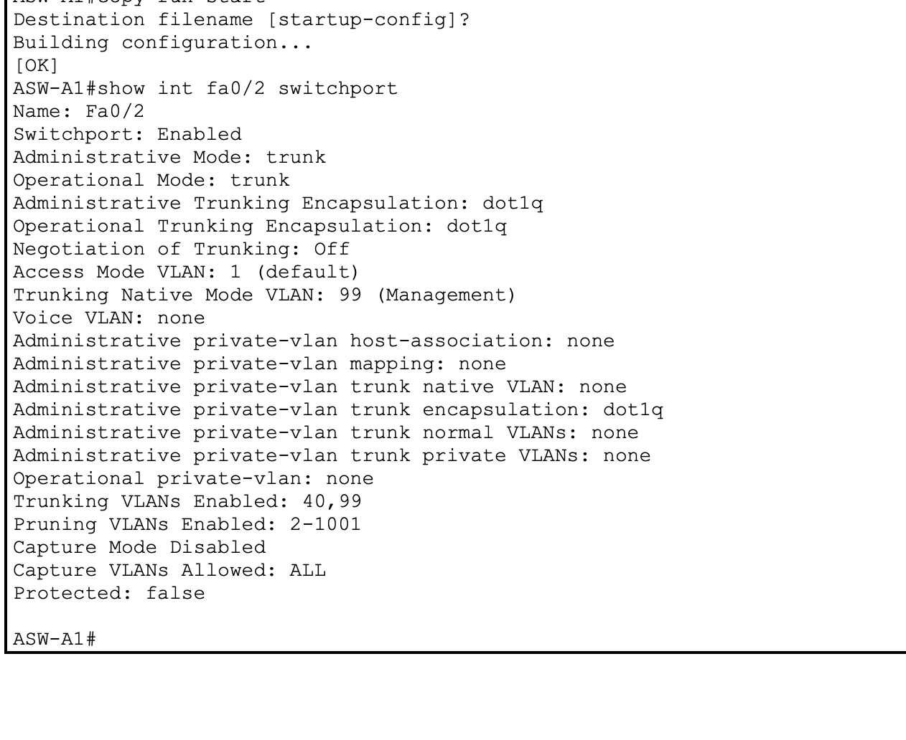
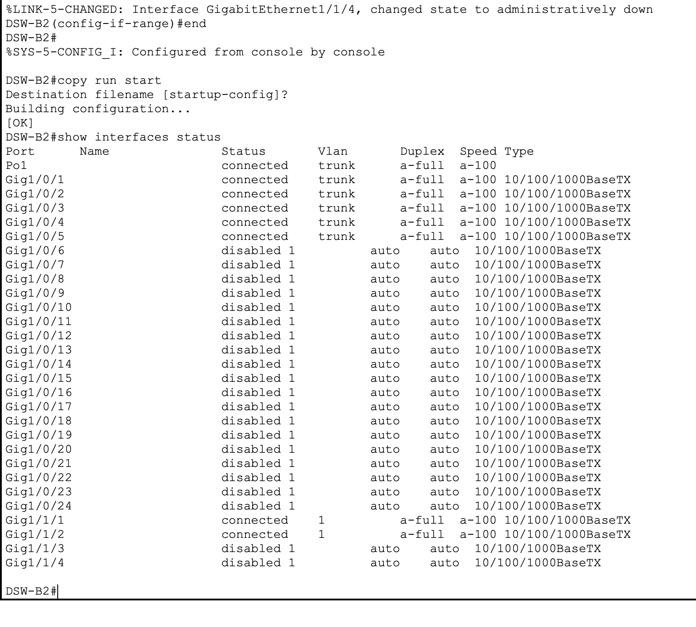
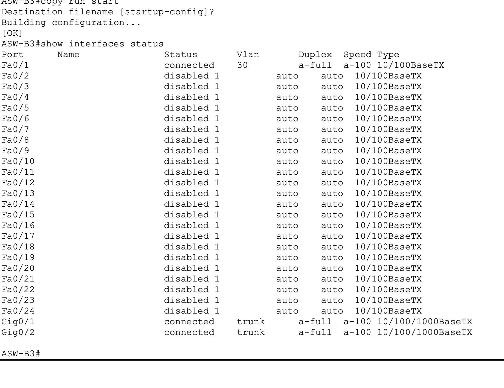

# Part 2 — VLANs & Layer 2 EtherChannel

## Objective

Build the Layer 2 foundation for two office networks using VLAN segmentation, trunking, redundant uplinks, EtherChannel, VTP, access ports, voice VLANs, and unused-port shutdowns.

## Layer 2 EtherChannel

### Office A

Configured `Port-channel1` between DSW-A1 and DSW-A2 using **PAgP**.



### Office B

Configured `Port-channel1` between DSW-B1 and DSW-B2 using **LACP**.



The Office B infrastructure trunk state was verified after the Layer 2 configuration:



## Infrastructure Trunks

Common trunk settings:

```text
switchport mode trunk
switchport trunk native vlan 1000
switchport nonegotiate
```

Office A allowed VLANs:

```text
10,20,40,99
```

Office B allowed VLANs:

```text
10,20,30,99
```

## VTP Version 2

Configured one distribution switch in each office as a VTPv2 server and the access switches as VTP clients.



## VLAN Database



### Office A
- VLAN 10 — PCs
- VLAN 20 — Phones
- VLAN 40 — Wi-Fi
- VLAN 99 — Management

### Office B
- VLAN 10 — PCs
- VLAN 20 — Phones
- VLAN 30 — Servers
- VLAN 99 — Management

## Access Ports

### LWAP-facing port



### Phone + PC port

```text
switchport mode access
switchport access vlan 10
switchport voice vlan 20
switchport nonegotiate
```



## WLC1 Trunk

```text
switchport mode trunk
switchport trunk allowed vlan 40,99
switchport trunk native vlan 99
switchport nonegotiate
```



## Unused Port Shutdown

I checked interface status before shutting down unused ports.

```text
show interfaces status
```

Distribution-switch verification:



Access-switch verification:



## Save and Verify

```text
copy running-config startup-config
```

## Status

**Complete**
