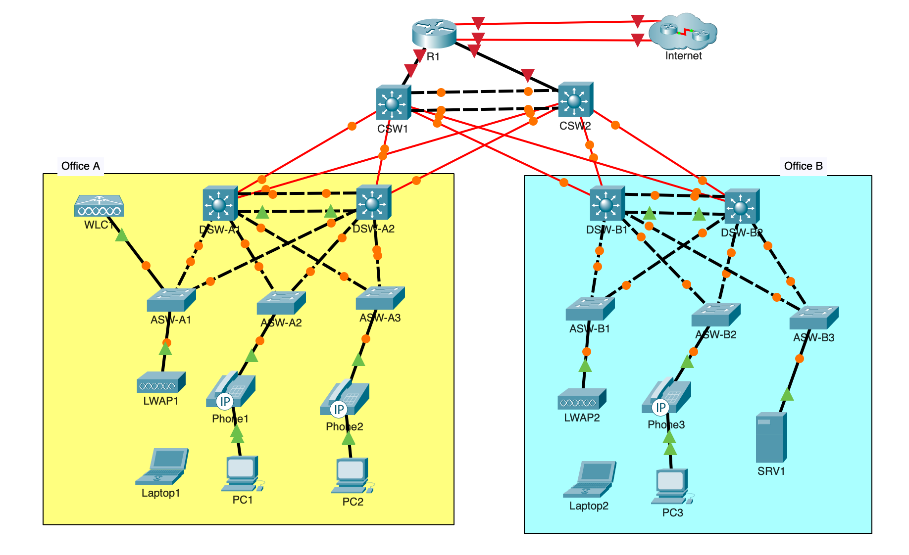

# Topology

The lab uses an enterprise-style multi-tier topology with core, distribution, and access switching plus routers, wireless infrastructure, phones, PCs, and a server.

## Office A

- DSW-A1 and DSW-A2 form the distribution layer.
- ASW-A1, ASW-A2, and ASW-A3 have redundant distribution uplinks.
- WLC1 and LWAP1 provide the wireless infrastructure.
- Phone/PC endpoints use separate data and voice VLANs.

## Office B

- DSW-B1 and DSW-B2 form the distribution layer.
- ASW-B1, ASW-B2, and ASW-B3 have redundant distribution uplinks.
- LWAP2 provides wireless access.
- SRV1 is attached to the server VLAN.

Part 3 documentation will add the Layer 3 addressing and HSRP details.
